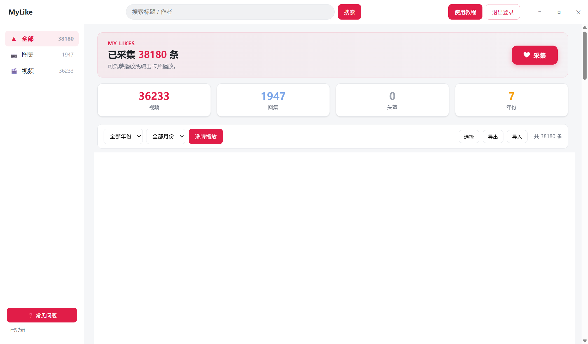

# MyLike

把抖音「喜欢」过的视频列表**完整保存到本地**，随时筛选、搜索、洗牌播放

> 仅用于整理你自己的喜欢列表，仅供个人使用。本应用与抖音 / 字节跳动无任何关联。

---

## 界面截图



> 截图展示了 MyLike 主界面：分类侧栏、数据仪表盘、年份/月份筛选、洗牌播放入口与视频卡片网格。

---

## 下载安装

1. 到 **[Releases](../../releases)** 页面下载最新版 **`MyLike.exe`**（推荐，直接下载，无需解压）
2. 放到任意目录（建议固定文件夹，如 `D:\MyLike`），双击运行——**无需安装 .NET、无需安装环境**

> 浏览器 / 下载工具拦截 exe 时，可改下 `MyLike-win-x64.zip`（内容就是同一个 exe）。

### Windows SmartScreen 提示怎么办

应用未购买代码签名证书，Windows 首次运行未签名程序会弹出「Windows 已保护你的电脑」，属正常现象：

1. 点击 **「更多信息」**
2. 点击 **「仍要运行」**
3. 之后正常使用（每台电脑只需操作一次）

> 应用不含恶意代码，源码完全开源可自行审查；要求 Windows 10/11，系统需有 WebView2 Runtime（一般随 Edge 自带，缺失时应用内会给出下载指引）。

## 快速上手

1. **登录**：点右上角「登录」→ 在弹出的窗口完成抖音登录（支持扫码）→ 成功自动关窗
2. **采集**：点「❤ 采集」抓取完整喜欢列表，顶部进度条实时显示进度，采完自动停止
3. **播放**：点任意卡片从该条顺序播放；或点「洗牌播放」随机播放当前筛选结果
------------------------------------------------------------------------------------------
注意：点赞上万的账号几乎必定触发接口限流，请等待一会儿后再采集，在弹窗里完成滑块验证后即可恢复正常
注意：点赞上万的账号几乎必定触发接口限流，请等待一会儿后再采集，在弹窗里完成滑块验证后即可恢复正常
注意：点赞上万的账号几乎必定触发接口限流，请等待一会儿后再采集，在弹窗里完成滑块验证后即可恢复正常
------------------------------------------------------------------------------------------
> 更完整的教程与常见问题在应用内：「帮助 → 使用教程 / 常见问题」。

## 数据与隐私

- **全部数据在本机** `%LOCALAPPDATA%\DouyinShuffle\`：
  - `Data\default\items.dylist` 播放列表（仅元数据）
  - `Data\default\state.json` 增量进度 / 账号标识
  - `Profiles\` WebView2 用户目录（登录态）
  - `init.log` 运行日志
- **播放链接不落盘**：链接有时效，播放时实时获取，本地不保存任何播放地址
- **不上传任何服务器**：数据与登录信息全部留在本机
- **备份迁移**：重装 / 换机前用「导出」生成 `.dylist`，新环境「导入」恢复

## 功能特性

**采集**
- 一键采集完整「喜欢」列表（标题 / 作者 / 发布时间 / 封面 / 类型）
- 增量采集：再次采集只补新内容，自动去重，翻到断点即停
- 断点续采：中途失败 / 限流 / 手动停止后，从上次进度继续，不遗漏不重复
- 风控自愈：接口被限自动弹滑块验证窗，恢复后自动续采，全程无需盯守

**播放**
- 洗牌播放：随机播放当前筛选范围；点卡片可从该条开始顺序播放
- 图集支持：图文帖自动轮播、进度条预览跳选、背景音乐播放
- 实时取链：每次播放向抖音获取最新直链，链接永久有效不落盘
- 原页看评论：一键跳转抖音原视频页，关闭后从记忆进度续播

**数据管理**
- 多维筛选：全部 / 视频 / 图集分类 + 年份 + 月份 + 标题作者搜索
- 勾选批量删除；`.dylist` 导入 / 导出备份，换电脑零成本迁移

## 技术架构

- **宿主**：WPF（.NET 10）+ WebView2，界面与播放器均为本地网页（嵌入程序集，随 exe 发布）
- **核心机制「浏览器即签名器」**：所有抖音接口请求都在一个屏幕外的隐藏抖音页中执行，由页面自身签名层自动补齐参数——应用不做任何逆向，抖音改版容错率高
- **风控应对**：接口三态探测（正常 / 验证页 / 待重试），分接口判断（收藏接口被限时 profile 接口仍可能正常），验证通过后自动断点续采
- 采集 / 播放 / 存储 / 日志分层解耦，单文件发布（自包含，免装运行时）

## 项目结构

```
src/DouyinShuffle.Win/
├─ App.xaml.cs / AppLog.cs         应用入口（异常兜底）/ 统一日志
├─ MainWindow.xaml.cs              UI 宿主：WebView2 编排、命令泵、窗口控制
├─ CollectOrchestrator.cs          采集编排：探测 → 预检 → 翻页 → 风控 → 断点续采
├─ DouyinAuthWindow.*              认证窗口（登录 / 滑块验证两用）
├─ DouyinEngineWindow.*            屏幕外抖音引擎页（登录态 / 签名 / 采集）
├─ DouyinPageWindow.*              抖音原页窗口（看评论）
├─ Capture/                        采集层
│  ├─ AwemeItem.cs                 数据模型（链接字段 [JsonIgnore]）
│  ├─ AwemeParser.cs               响应解析
│  ├─ LikeCollector.cs             采集执行 + 消息泵 + 增量去重 + 实时取链
│  ├─ DouyinProbe.cs               接口探针（三态健康判定）
│  ├─ ScriptLoader.cs              嵌入 JS 加载器
│  └─ Scripts/                     采集 / 探测 / 取链脚本
├─ Player/                         播放层
│  ├─ PlaybackController.cs        队列 / 取链 / 预取 / 失效跳过
│  └─ LinkProber.cs                直链有效性探测
├─ Storage/                        存储层
│  ├─ LikeListStore.cs             播放列表与同步状态（原子写）
│  └─ AtomicFile.cs                原子写入（tmp + Replace）
├─ Export/Exporter.cs              .dylist 导入 / 导出
└─ WebUi/                          本地前端（嵌入资源，运行时提取）
```

## 常见问题

- **采集数量比抖音显示的喜欢数少？** 正常：已删除 / 下架 / 私密的内容接口不再返回，返回但无法播放的会标记「失效」。
- **采集太快被限流？** 平台行为。按提示完成滑块验证或稍候即可，已采数据都在。
- **视频黑屏无画面？** 多为 H.265 编码且系统缺 HEVC 解码，会自动尝试备用链接；也可给 Win10 装「HEVC 视频扩展」。
- **支持收藏夹吗？** 当前版本仅支持「喜欢」列表。

## 免责声明

- 本项目仅供**个人学习与本地数据整理**使用，请勿用于任何商业用途或违反平台服务条款的场景
- 应用与抖音 / 字节跳动**无任何关联**，不为其产品背书
- 采集行为需遵守抖音的用户协议与相关法律法规；采集数据为**用户本人的账号内容**，请自行承担合规责任
- 项目作者不对因使用本应用产生的任何账号封禁、数据丢失等问题负责

## License

[MIT](LICENSE) — 仅供个人使用；请遵守所使用平台的服务条款。
